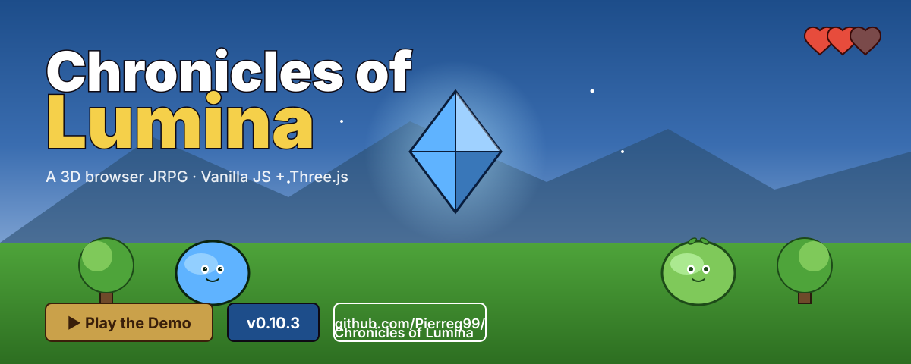

# Chronicles of Lumina

      

<p align="center">
  
</p>

<p align="center">
  <a href="https://pierreg99.github.io/Lumina-Game/"><strong>▶ Play the Live Demo</strong></a>
  · <a href="chronicles-of-lumina/DEPLOY.md">Deploy docs</a>
  · <a href="chronicles-of-lumina/ROADMAP.md">Roadmap</a>
  · <a href="https://github.com/Pierreg99/Lumina-Game/releases">Releases</a>
</p>

3D-Browser-Action-Adventure im farbenfrohen JRPG-Fantasy-Stil. Vanilla JS + Three.js, ES-Module, kein Build-Step.

> Vertikale Slice Demo: Sammle 10 Lichtkristalle, besiege den Nebel-Koloss, reinige den Schrein. Erkunde **5 Biome** über **Portale**, baue dir **Custom-Maps** mit geteilbaren URLs, und spiele täglich das **Daily Run** für die Highscore.

## Quickstart

```bash
cd chronicles-of-lumina
python3 -m http.server 8080
# Browser: http://localhost:8080/game.html
```

Oder mit Node:

```bash
npx serve .
```

**Täglich neuen Seed spielen:** `http://localhost:8080/game.html?seed=12345`

**Custom Map laden (Phase 19+):** `http://localhost:8080/game.html?map=verdant:20473104`
(Zone:Smöl-Base36-Seed — Seed auf dem End-Screen via "Seed teilen" exportieren)

## Steuerung

| Taste | Aktion |
|-------|--------|
| WASD / Pfeile | Bewegung |
| Maus ziehen | Kamera rotieren |
| Leertaste / Klick | Angriff (3er-Combo) |
| Shift | Ausweichrolle (kurz unverwundbar) |
| E | Interaktion (Schrein, Dorfälteste) **oder Portal betreten** |
| Esc / P | Pause |
| I | Inventar |
| C | Codex / Bestiarium |
| Mausrad über Minimap | Minimap zoomen |

Mobile: virtueller Joystick + Aktions-Buttons (E / Rollen / Angriff).

## Features

### Open World (Phase 19+)
- **5 thematische Biome** — Smaragdwald (Wald, Starter) · Golddünen (Wüste, mittel) · Sturmgipfel (Berge, schwer) · Nebelmarsch (Sumpf, mittel-schwer) · Glutkessel (Vulkan, Endgame)
- **Sichtbare Portale** — leuchtende Ringe auf der Karte, drücke E um das Biom zu wechseln
- **Biom-spezifische Atmosphäre** — eigener Himmel, Fog, Boden-Farbe pro Zone
- **URL-shared Custom Maps** — `?map=zoneId:seed` lädt eine geteilte Karte direkt
- **In-World Zone-Indicator** — kleines Badge oben mitten, zeigt aktuelles Biom
- **Schwierigkeits-Pips** auf den Biome-Cards signalisieren, was einen erwartet

### UI (Phase 9+)
- **Mystical-Violet-Theme** — durchgehende Farbpalette: Violet (Akzent), Cyan (XP/Magie), Rose (Boss/Damage), Emerald (HP)
- **Lucide-Style SVG-Icons** — 19 inline-Icons für HUD, Buttons, Inventar, Codexe
- **Frosted-Glass-Panels** — backdrop-blur + inner Top-Highlight, fühlt sich premium an
- **Cinzel Display-Font** — Titel in einer Fantasy-Serif, Body in Inter
- **Cinzel-Titel + Glow** — Start-Screen und Pause-Menü mit dramatischem Glow
- **Kbd-Badges** — alle Tasten-Anzeigen als gestylte `<kbd>`-Elemente
- **Colorblind-Mode** — Pattern + Outline als zusätzliches Signal, nicht nur Farbe
- **Reduced-Motion-Mode** — alle Animationen respektieren `prefers-reduced-motion`
- **Settings-Modal** mit Volume-Slidern, Custom-Toggles, Reset-Button

### Spielgefühl
- **Hit-Stop** — Treffer frieren das Spiel kurz ein (50–180ms je nach Größe)
- **Screen-Shake** — Kameraschüttler mit Decay, 3 Stärken
- **Slowmo** — 300ms Zeitlupe bei Boss-Slam
- **Camera-Lag** — Kamera trägt nach, wenn der Spieler schnell läuft
- **Camera-Kick** — Kamera hebt sich weg vom Einschlagspunkt
- **Anticipation-Frames** — Schwert zieht vor dem Schlag kurz zurück
- **Adaptive Music** — Ambient-Pad immer, Combat-Percussion faded bei Gegnerkontakt ein

### Kampfsystem
- **3 Schleim-Varianten** — Wiesen (Nahkampf), Blatt (springt), Nebel (Fernkampf-Projektile)
- **Boss: Nebel-Koloss** — 25 HP, Projektil-Salve + Bodenschlag mit Ringwelle
- **Combo-Indicator** — HUD-Bogen füllt sich pro Hit, decay'd nach 0.45s, resetted bei Schaden
- **Damage-Direction** — roter Pfeil am Bildschirmrand zeigt, woher der Schaden kam
- **3-Stufen-XP** — Level-Ups geben Max-HP +1, alle 2 Level +1 Angriff
- **Heilbeeren-Loot** — Drop von Gegnern, heilt 2 HP
- **Dodge-i-Frames** — Shift = unverwundbar für 0.35s

### Quest
- **Intro** durch die Dorfälteste mit Hinweisen
- **Tutorial-Overlay** — kontextsensitive Tipps in den ersten 20 Sekunden
- **Lichtkristalle sammeln** (0/10)
- **Boss spawnt** automatisch bei 10 Kristallen
- **Schrein-Reinigung** nach Boss-Sieg
- **Endscreen** mit Score, Zeit, Kills, Kristallen, Map-Code

### UI / UX
- **Screen-State-Machine** — explizite Übergänge zwischen Start / Playing / Paused / Dialog / Inventory / Codex / Endscreen
- **Deklarative HUD** — Panels lesen `state` + Events, kein `getElementById` in `main.js`
- **Dialog-Choices** — verzweigte Gespräche (z.B. Elder-Fragen)
- **Pause-Hierarchie** — Resume / Einstellungen / Neustart
- **Tooltips** im Inventar (Hover/Tap)
- **Damage-Flash** — roter Vollbild-Overlay bei Schaden
- **i18n-ready** — `t()`-Modul + DE/EN-Locales für Codexe + Dialoge

### Persistenz
- **Codex/Bestiarium** — 8 Einträge (Gegner, Items, Orte, Boss). Entsperrt sich automatisch beim ersten Kontakt. In LocalStorage gespeichert.
- **Settings** — Volume, Sensitivity, Reduce-Motion, Colorblind-Mode, FPS-Anzeige. LocalStorage.
- **Daily Seed** — jeden Tag ein neuer Spawn-Layout. URL-Param `?seed=…` zum Teilen. End-Screen zeigt Score.
- **Map-Codes** — `zone:seed`-Format, teilbar via "Seed teilen" auf dem End-Screen.

## Modul-Architektur

```
chronicles-of-lumina/src/
├── main.js                    # 5-Zeilen-Bootstrap: new Game(canvas)
├── core/                      # Game, Loop, Config, Constants, State, EventBus, Settings, HitStop, Screen-State
├── engine/                    # Renderer, Scene, Camera (inkl. Shake/Kick), Lighting, Materials, Audio, Input, Collision
├── world/
│   ├── zones/                 # Phase 19+: 5 Biome-Definitionen + Map-Code-Codec
│   ├── zone-portal.js         # Phase 19+: sichtbare Portale + Overlap-Test
│   ├── world-builder.js       # assembliert alles, zone-aware
│   ├── terrain.js             # zone-aware (Sand für Dunes, Schnee für Peaks, …)
│   ├── environment.js         # zone-aware Sky/Fog/Ambient
│   ├── village.js, forest.js, shrine.js, props.js
│   ├── particles.js, minimap.js
├── entities/                  # Player, Enemy-Base, 3 Slimes, Boss, Projectile, Loot, NPC-Elder
├── systems/                   # Combat, Enemy, Boss, Quest, XP, Inventory, Dialogue, Interaction, Feedback, Codex, Spawn
├── ui/
│   ├── icons.js               # Phase 9+: 19 Lucide-Style inline SVGs
│   ├── zone-picker.js         # Phase 19+: Biome-Cards + Map-Code-Input
│   ├── interaction-hint.js    # payload-aware (Schrein / Elder / Portal)
│   ├── hud.js                 # SVG-Hearts, echte HP-Bar
│   ├── menus.js, dialog-panel.js, quest-panel.js, xp-panel.js, boss-bar.js
│   ├── inventory-panel.js, mobile-controls.js
│   ├── combo-indicator.js, damage-direction.js, tutorial.js
│   ├── codex-panel.js, settings-panel.js
│   └── perf-overlay.js
└── utils/                     # Math, Random, Pool, DOM, Time, UV, Tween, AssetGen
```

**Bootstrap:** `main.js` ist seit Refactor R5/R6 exakt 5 Zeilen — die gesamte Verdrahtung lebt in der `Game`-Klasse (`core/game.js`) mit privaten Build/Wire-Methoden.

**Schichten:** `utils` → `core` → `engine` → `world`/`entities` → `systems` → `ui`
**Kopplung:** Event-Bus + Dependency-Injection. Keine zirkulären Imports.
**Source of Truth:** `core/config.js` für Balancing, `core/state.js` für Runtime-State, `core/screen-state.js` für UI-Phasen.

**`Game`-Klasse (in `core/game.js`):**
- `_build()` — Engine → Entities → Systems in Dependency-Order
- `_wireUI()` — alle UI-Panels + Dialog/Inventory/Codex-Toggle
- `_wireGlobalEvents()` — Player-Lifecycle + Scene-Beats + Zone-Change
- `_buildStartInfo()` / `_buildLoop()` / `_buildPauseWiring()`
- `_update(dt)` / `_render()` — Loop-Callbacks
- `_handleStart()` / `_endGame(win)` — Game-Actions
- `_handleZoneChange()` / `_disposeWorld()` — Phase 19+: Biome-Wechsel

**Systems:** Alle seit Refactor R1 mit `constructor(game)` statt langer Parameterlisten.

## Erweiterung

- **Neuer Gegnertyp:** `entities/` + Spec in `enemy-base.js` + Eintrag in `systems/enemy-system.js` INITIAL_SPAWNS
- **Neue Quest:** `core/config.js` `quest.*` + `systems/quest-system.js`
- **Neues Biom:** Eintrag in `world/zones/index.js` — Sky/Fog/Ground/Enemy-Pool/Spawns/Difficulty definieren, fertig. Der Portal-Selector, Indicator und Terrain wickeln sich automatisch darum.
- **Neues Icon:** Eintrag in `src/ui/icons.js` (Lucide-Pfade, 24×24 viewBox, currentColor).
- **Neue Fähigkeit:** `entities/player.js` + Animation in `player-animation.js` + Combat in `player-combat.js`
- **Neues Settings-Feld:** `core/settings.js` DEFAULTS + UI in `settings-panel.js`
- **Neuer Codex-Eintrag:** `systems/codex-system.js` ENTRIES-Liste

## Performance

- Performance-Ziel: 60 FPS auf Desktop, 30 FPS auf Mobile
- Object-Pooling für Partikel (Three.js Points)
- Atlas-basierte Texturen (4×4, 512×512)
- Geclipptes Rendering (FOV 55°, Sichtweite 200u)
- Hit-Stop überspringt Updates, nicht Render
- Slowmo skaliert `dt`, nicht Game-State
- Zone-Wechsel: 6-Frame Hit-Stop + 220ms-Fade, damit der World-Rebuild nicht poppt

## Lizenz

MIT — siehe [`LICENSE`](./LICENSE) (TODO).

## Credits

- Code: Mavis
- Texturen: im `assets/`-Ordner + prozedural via `src/utils/asset-gen.js`
- Musik/SFX: Web Audio API (synthetisiert, keine Audio-Assets)
- Inspiration: klassische JRPGs (Final Fantasy, Dragon Quest) — ohne Marken, ohne Assets
- Icons: Lucide (MIT)

## Roadmap & Doku

- [`ROADMAP.md`](./ROADMAP.md) — 19 Phasen done, alle Quality-Achsen abgehakt
- [`PLAN.md`](./PLAN.md) — Detaillierte Pläne für Phase 12–18 (Hygiene, JSDoc, Distribution, Security, Tests, i18n, Performance)
- [`REFACTOR.md`](./REFACTOR.md) — Phase R1–R7 Plan und Status
- [`CHANGELOG.md`](./CHANGELOG.md) — Versions-Historie (Keep-a-Changelog-Format)
- [`DEPLOY.md`](./DEPLOY.md) — Multi-Plattform-Deployment (🌐 Web · 🤖 Android · 🖥️ Desktop)
- [`src/utils/asset-gen.js`](./src/utils/asset-gen.js) — prozeduraler Asset-Generator

## Assets (prozedural)

Alle Texturen werden zur Laufzeit im Browser via **Canvas-2D** generiert — keine externen
Bilddateien, kein Build-Step. Der Master-Atlas (`512×512`, 4×4 Grid) wird in
`engine/materials.js` als `THREE.CanvasTexture` geladen. Die 16 Zellen + 4 Standalone-Portraits
sind einzeln abrufbar via `AssetGen.cells.*` / `AssetGen.portraits.*` / `AssetGen.icons.*`.

Visueller Stil: Granblue Fantasy / Star Ocean — dicke Outlines, satte Cell-Shading-Töne,
Glanzpunkte, Sparkles und Glows auf UI-Items. Boss- und Codex-Portraits haben
Hintergrund-Vignette und dramatische Beleuchtung.

**Assets exportieren** (für Marketing, PWA-Manifest-Icons, statisches Hosting):
Browser-Console öffnen und `AssetGen.exportAll();` ausführen — alle 23 Dateien (21 Game-Assets
+ 2 PWA-Icons) werden als PNG-Downloads gespeichert.

## Discord-Bot (LuminaBot)

Unter [`bot/`](./bot/) liegt der offizielle **LuminaBot** (discord.js v14, ESM, Node 18+).

- 8 Slash-Commands: `/help` · `/status` · `/announce` · `/patch` · `/lore` · `/leaderboard` · `/bugreport` · `/suggestion`
- 4 Event-Handler: Welcome, Levelup, Screenshot-Auto-React, Soft-Moderation
- JSON-File-Persistenz für Reports, Suggestions, Leaderboard
- Docker-Support (`Dockerfile` + `docker-compose.yml`)

```bash
cd bot
cp .env.example .env       # DISCORD_TOKEN + DISCORD_CLIENT_ID eintragen
npm install
npm test                   # 20+ Modul-Tests, kein Discord-Connect
npm run deploy             # Slash-Commands registrieren
npm start                  # Bot online
```

## Testing

```bash
npm test
```

**99 Assertions in 8 Test-Dateien, alle grün.** Coverage:

| Modul | Datei | Was |
|-------|-------|-----|
| `core/event-bus` | `event-bus.test.mjs` + `event-bus-edge.test.mjs` | Subscribe/Emit/Unsubscribe, Error-Handling |
| `core/state` | `state.test.mjs` | Phase-Sync, Mutation |
| `core/screen-state` | `screen-state.test.mjs` | Übergangs-Validierung, history |
| `core/loop` | `loop.test.mjs` | HitStop, Slowmo, timeScale |
| `core/settings` | `settings.test.mjs` | LocalStorage, Defaults, Reset |
| `core/hitstop` | `hitstop.test.mjs` | Frame-Counter, Resume |
| `utils/tween` | `tween.test.mjs` | Easing, Retarget, Delay |
| `utils/pool` | `pool.test.mjs` | Object-Reuse, Leak-Detection |
| `systems/dialogue` | `dialogue.test.mjs` | Say/Choice/History |
| `systems/codex` | `codex.test.mjs` | Unlock, Persist |
| `systems/feedback` | `feedback.test.mjs` | Event-Chain |
| `systems/i18n` | `i18n.test.mjs` | t() + Locale-Coverage |
| `ui/perf-overlay` | `perf-overlay.test.mjs` | FPS-Sampling |
| **`world/zones` (P19+)** | `zones.test.mjs` | Registry, Map-Code-Codec, Round-Trip |

Kein externes Framework — custom 50-Line-Runner in `tests/_runner.mjs`, Mock-Helfer in
`tests/_setup.mjs`. Three.js-abhängige Systeme (Rendering, Scene-Graph) sind nicht
unit-getestet.

## Deployment

Siehe [`DEPLOY.md`](./DEPLOY.md) für die vollständige Pipeline:

| Plattform | Pfad | Verpackung |
|---|---|---|
| 🌐 Web | statischer Host | `python3 -m http.server 8080` |
| 🤖 Android | PWA / TWA | `npx @bubblewrap/cli build` |
| 🖥️ Desktop | Electron | `cd desktop && npm run build:win` |
